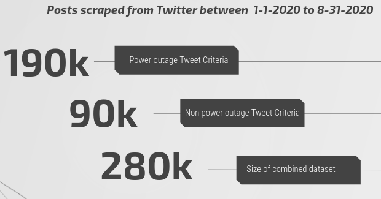
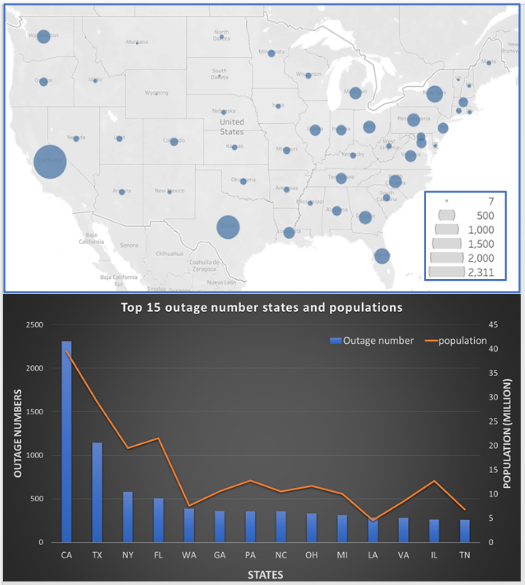
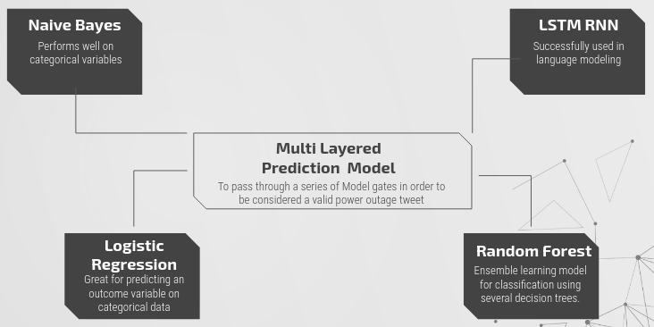
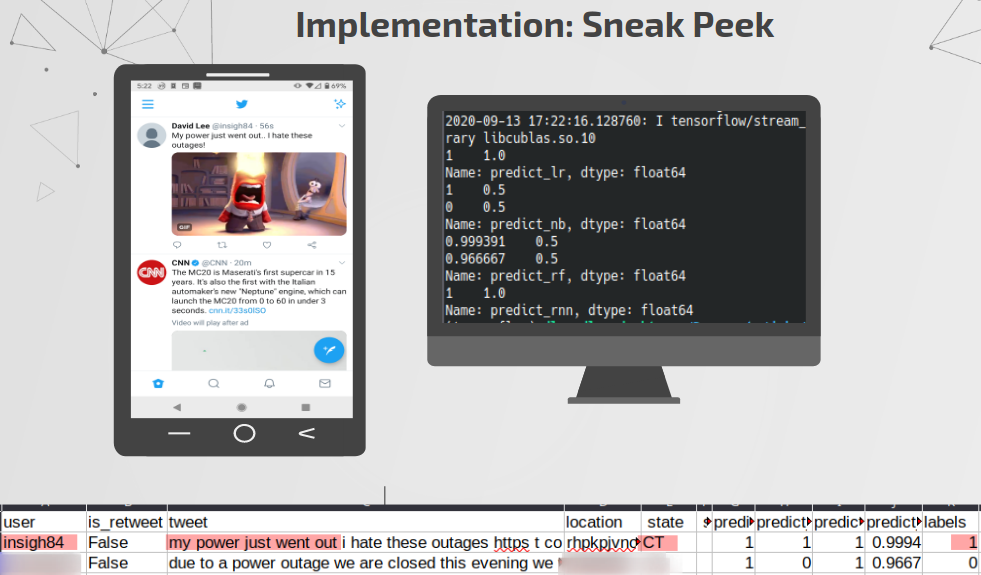
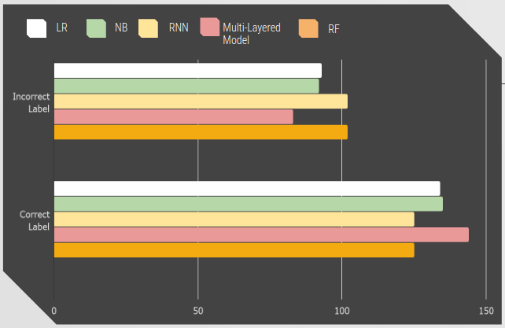
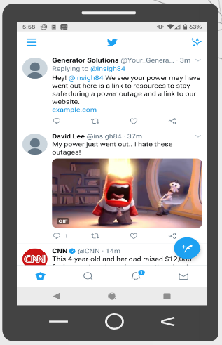
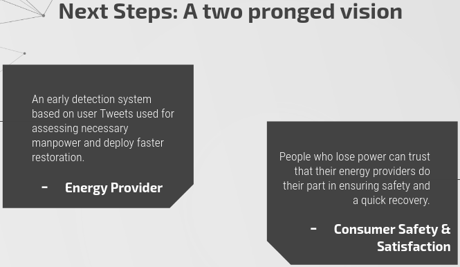

# Using Social Media to Map Potential Power Outages
***Authors:*** Aidan Curley, Bill Fu, David Lee, Nathan Seither  
## Problem Statement  
During a disaster, residential areas often experience massive power outages that can last for hours or days. Traditional methods to map power outages include live feeds and data that is provided by major utility companies as well as on satellite data that capture the extent of light emitted at night. Although accurate, it does not reach the customer in a way that is impactful to the end consumer. Our method will utilize a Twitter bot to detect tweets about power outages in real time and map the users location if they are experiencing a power outage. Additionally we hope to respond to each tweet with supporting material and resources.

## Project Files
Here is the project workflow:  
- [01_scraping_tweets.ipynb](./new_code/01_scraping_tweets_5.ipynb)     
- [02_preprocess.py](./new_code/02_preprocess.py)      
- [03_outage_analysis.py](./new_code/03_outage_analysis.py)  
- [04_models.py](./new_code/04_models.py)  
- [04b lstm_rnn.py](./new_code/04b_lstm_rnn.ipynb)  
- [05_twitter_bot.py](./new_code/05_twitter_bot.py)     
- [05b_neural.py](./new_code/05b_neural.py)  
- [06_classify_tweets.py](./new_code/06_classify_tweets.py)   
- [07_twitter_bot_evaluation.py](./new_code/07_twitter_bot_evaluation.ipynb)  

## Executive Summary
Our team approached this problem using an automated social media tool called a Twitter bot to locate the areas of power outages using natural language processing. We came to the conclusion that using Twitter will be the best platform since it's in realtime and has the production capability of operating continuously. Our final product was able to successfully find tweets in real time, verify it's accuracy, and insert it into a database that could be queried and analyzed. There are additional capabilities within our model making it a plug and play application, customizable to any business needs.  

## Data Collection

Before deploying a bot we had to train our models on a lot of data so when we pull in tweets from the bot we can get accurate predictions if the tweet is actually a power outage or not. We used [GetOldTweets3](https://github.com/Mottl/GetOldTweets3) to scrape 280,000 tweets from January 1st, 2020 to August 31st, 2020. From those tweets 150,000 of them contain the queries "my power went out", "I lost power", "there is a power outage", or "I have no power." The remaining 130,000 tweets are for random queries such as "we went out shopping" and "The weather is nice." We wanted to add noise into our data so the models can better understand what tweets are actually about power outages.  

## EDA
This analysis was done with 28k tweets we collected at the early stage. 
Among these 28k posts, 11k of them had location information.
From the chart at top left, we can see that most of  the outages are located in coastal, north east, and central east states.
The bottom chart had the top 15 outage states plotted with their populations, we noticed that the power outages were highly correlated with population.

## Modeling Process
After doing the initial data cleaning, analysis, and labelling, we built four models to classify whether a post is a true power outage or not. The models were: a Naive Bayes classifier, a logistic regression classifier, a random forest classifier, and long short-term memory (LSTM) recurrent neural network (RNN) classifier. 

Each model generated a predicting label for a tweet: 0 for not power outage and 1 for power outage. With the collected data, we were able to achieve 89% accuracy on both training and testing datasets for each of these models.
In order to push our models to the production environment, we need to eliminate false positives (false power outages). So that we used a four pronged approach to our final modeling strategy. Namely, if each individual model generated a 1 then we will classify that tweet as a true power outage. This enabled our models to have the greatest chance at making the most accurate prediction.

## Implementation

After modeling was complete, we moved onto the implementation of our Twitter bot. This was implemented with python scripts at this stage. While running, the bot listened for tweets 24/7 until it was told to stop. 

As the monitoring criteria was met, a new tweet came in. It would go through preprocessing and the modeling automatically. The tweet then received a prediction label: either being a 0 for not a power outage or 1 for a power outage tweet. If this tweet was classified as a power outage tweet, it would automatically map out where the outage is located based on the location that the user inputted. 

We took a small subset of tweets we pulled with our bot and hand verified these labels either being a 0 or a 1 and as we can see in this graph, we had more correctly labeled tweets than incorrectly labeled tweets . And we can see that our multi-layered approach which is in pink was able to correctly label more tweets and incorrectly labeled less tweets than any single model.

We evaluated metrics on a small subset of new tweets. We pulled live tweets with our bot and fed them into each individual model.  The logistic regression achieved an accuracy score of 58.26%. The naive bayes achieved an accuracy score of 59.57%. The LSTM RNN achieved a score of 55.65%. And the random forest also achieved an accuracy score of 55.65%. Our multi-layered model achieved an accuracy score of 63.91% which is greater than any singular model. We have chosen this model as our best production model. These metrics are on a small subset of tweets we pulled in live with our bot so there are some improvements that will need to be made in the future with training our models.

## Conclusions
Our team concludes that mapping power outages through Tweets is possible with our classification model and Twitter bot. We successfully were able to label new tweets with a prediction generated from our multi-layered model. Even though our training and testing scores were very impressive, we were able to identify areas where we can further improve our classification accuracy on live new tweets with adjustments on the initial scraped tweets for training our models along with adjusting hyper parameters.
Identifying Twitter API limitations also point our team to generalizing the key phrases we used for evaluating our model to lower bias in our analysis. Our accuracy on 227 streamed tweets we manually labeled suggests that we have over fit our model on the  phrases we initially trained on. Gathering more data is a necessary step to increase accuracy.
## Next Steps 
Our hope is that one day we can help power providers in ensuring that users that tweet about experiencing an outage would know safety best practices, with links to helpful resources.

  
With this technology we believe we can map out power outage disasters and help both energy providers and the customers they serve.
We hope our tool will help bridge the gap between power companies and the residents they serve.

To ensure this goal, refinement and scalability will have to include the following:
1. Refine our production models to achieve a higher accuracy rating
2. Containerize the application using Docker containers, to ensure compatibility across different platforms and to easily scale our solution. These containers would include a database such as Redis or Mongodb.
3. Partnership with Twitter to increase successful implementation and location data
4. Increase the number of bots to ensure 100% operational capacity

## Citations  
 - http://docs.tweepy.org/en/v3.5.0/index.html  
 - https://github.com/Mottl/GetOldTweets3  
 - https://github.com/Mottl/GetOldTweets3/issues/57 Clairedevries 
 - https://github.com/vprusso/youtube_tutorials/blob/master/twitter_python/part_1_streaming_tweets/tweepy_streamer.py
 - https://en.wikipedia.org/wiki/List_of_states_and_territories_of_the_United_States_by_population  
 - https://www.youtube.com/watch?v=fqMOX6JJhGo  

